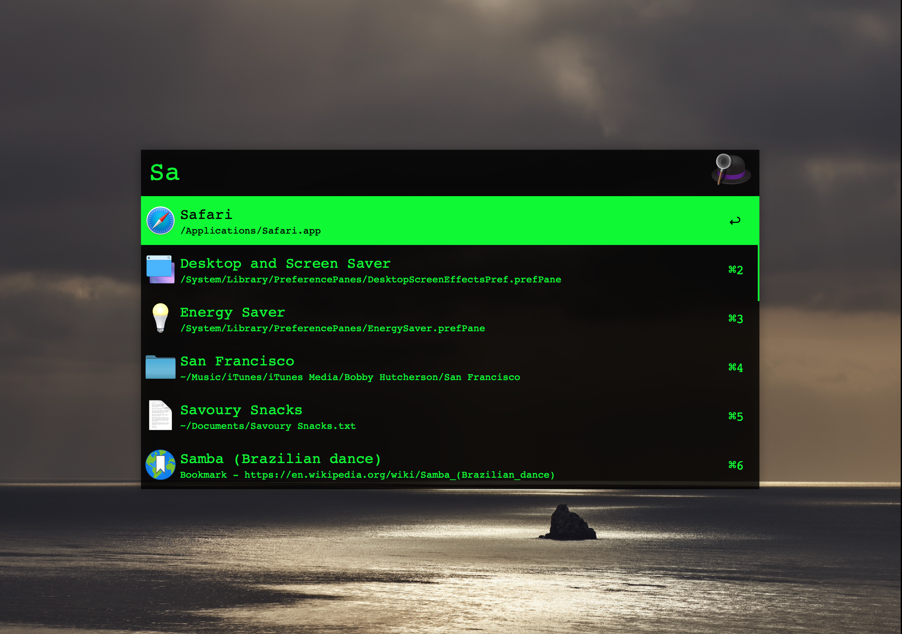

# alfred-theme-monochrome
Old terminal like monochrome color theme and monospace font

## Requirements

* [Alfred](https://www.alfredapp.com/)

## Install

* [Download](Monochrome.alfredappearance)
* Double click on `Monochrome.alfredappearance`
